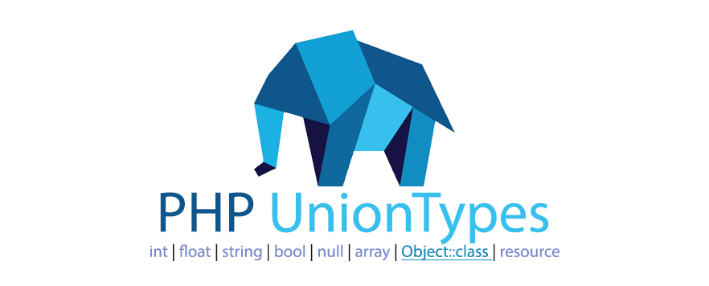

<p align="center">
    <a href="LICENSE" target="_blank">
        
    </a>
    <a href="https://travis-ci.org/flashios09/php-union-types" target="_blank">
        
    </a>
    <a href='https://coveralls.io/github/flashios09/php-union-types?branch=master' target="_blank">
        
    </a>
    <a href="https://packagist.org/packages/flashios09/php-union-types" target="_blank">
        
    </a>
</p>

Requirements
------------------------------------------------------------------------------
- PHP 7.1+
- Composer

Installation
------------------------------------------------------------------------------
```bash
composer require flashios09/php-union-types
```

Usage
------------------------------------------------------------------------------
#### [UnionTypes::assert](#uniontypes-assert)

```php
UnionTypes::assert(mixed $value, string[] $types): void
```
Throw a **TypeError** if the given value isn't in the passed union type.

See the full list of the [valid types](#valid-types) `$types` string array, e.g. `['int', 'string', Posts::class, ...]`.

Examples:

- ```php
  UnionTypes::assert(1.2, ['int', 'float']);
  ```
  ✓ should pass

- ```php
  UnionTypes::assert('1.2', ['int', 'float']);
  ```
  ✖ will throw a **TypeError** *"'1.2' must be of the union type `int|float`, `string` given"*

- ```php
  UnionTypes::assert('1.2', ['int', 'float', 'string']);
  ```
  ✓ should pass

#### [UnionTypes::is](#uniontypes-is)

```php
UnionTypes::is(mixed $value, string[] $types): bool
```
Check if the value type is one of the passed types.

Works just like `UnionTypes::assert($value, $types)` but it will return a **bool**(`true`/`false`) instead of throwing a **TypeError**.

See the full list of the [valid types](#valid-types) `$types` string array, e.g. `['int', 'string', Posts::class, ...]`.

Examples:

- ```php
  UnionTypes::is(1.2, ['int', 'float']);
  ```
  equivalent to `is_int(1.2) || is_float(1.2)`

  ✓ return `true`

- ```php
  UnionTypes::is('1.2', ['int', 'float']);
  ```
  equivalent to `is_int('1.2') || is_float('1.2')`

  ✖ return `false`

- ```php
  UnionTypes::is('1.2', ['int', 'float', 'string']);
  ```
  equivalent to `is_int('1.2') || is_float('1.2') || is_string('1.2')`

  ✓ return `true`

#### [UnionTypes::assertFuncArg](#uniontypes-asserfuncarg)

```php
UnionTypes::assertFuncArg(string $argName, string[] $types): void
```
Throw a **TypesError** if the value of the argument isn't in the union type.

See the full list of the [valid types](#valid-types)  `$types` string array, e.g. `int`, `string`, `Posts::class` ...

Examples:

- ```php
  function add($a, $b)
  {
      UnionTypes::assertFuncArg('a', ['int', 'float']);
      return $a + $b;
  }
  // invocation
  add(1.2, 1);
  ```
  ✓ should pass

- ```php
  class Math
  {
    public static function add($a, $b)
    {
      UnionTypes::assertFuncArg('a', ['int', 'float']);
      return $a + $b;
    }
  }
  // invocation
  Math::add('1.2', 1);
  ```
  ✖ will throw **TypeError** *"Argument `a` passed to `Math::add(int|float $a, ...)` must be of the union type `int|float`, `string` given"*

- ```php
  $closure = function ($a, $b) {
      UnionTypes::assertFuncArg('a', ['int', 'float', 'string']);
      return $a + $b;
  };
  // invocation
  $closure('1.2', 1);
  ```
  ✓ should pass

#### [Valid types:](#valid-types)
- `'string'`
- `'int'`(not `'integer'` or `'double'`)
- `'float'`(not `'double'` or `'decimal'`)
- `'bool'`(not `'boolean'`)
- `'null'`(not `'NULL'`)
- `'array'`
- Any valid **classname string**, e.g `Table::class` or `'Cake\ORM\Table'`
- `resource`

#### [Configuration](#configuration)
- [**Friendly editor file path**:](#friendly-editor-file-path)

  By default, every thrown **Error** or **Exception** will have a **called in** at the end of the message `called in #{stackTraceIndex} {file}:{line}`, e.g. `called in #0 /path/to/app/src/Controller/PostsController.php:126`.

  To have a friendly editor(VSCode, Atom, SublimeText, ...) file path **relative to the workspace**, you need to define a constant `UnionTypes.PATH_TO_APP` somewhere, e.g:
  ```php
  // config/bootstrap.php
  define('UnionTypes.PATH_TO_APP', '/path/to/app/');

  // using `$_SERVER`(isn't available in **php cli**)
  $PATH_TO_APP = isset($_SERVER['DOCUMENT_ROOT']) ? $_SERVER['DOCUMENT_ROOT'] . DIRECTORY_SEPARATOR : '';
  define('UnionTypes.PATH_TO_APP', $PATH_TO_APP);
  // using `dirname(__FILE__)`, maybe you need to remove/add some parts, depending on the `__FILE__` location.
  define('UnionTypes.PATH_TO_APP', dirname(__FILE__) . DIRECTORY_SEPARATOR;
  // using the `PWD` key of the `getEnv()` array
  define('UnionTypes.PATH_TO_APP', getEnv()['PWD'] . DIRECTORY_SEPARATOR;
  ```
  Now the `/path/to/app/` **prefix** will be removed from the **called in**, e.g. `called in #0 src/Controller/PostsController.php:126`.

Contributing
------------------------------------------------------------------------------

### Installation

* `git clone git@github.com:flashios09/php-union-types.git`
* `cd php-union-types`
* `composer install`(will install dev dependencies like `whoops`, `kahlan`, `var-dumper`, `cakephp-codesniffer`)

### Start a local php server with livereload
* `yarn install`(node dependencies)
* `yarn serve`(then add your code to `php-union-types/index.php` and open a browser window at `http://localhost:3080`)

### Start a local kahlan test with livereload
* `yarn install`(node dependencies)
* `yarn test`(it will watch any change in the `spec` folder and re-launch the test)

### Linting

* `composer cs-check`
* `composer cs-fix`

### Running test

* `composer test`


License
------------------------------------------------------------------------------
This project is licensed under the [MIT License](LICENSE.md).
